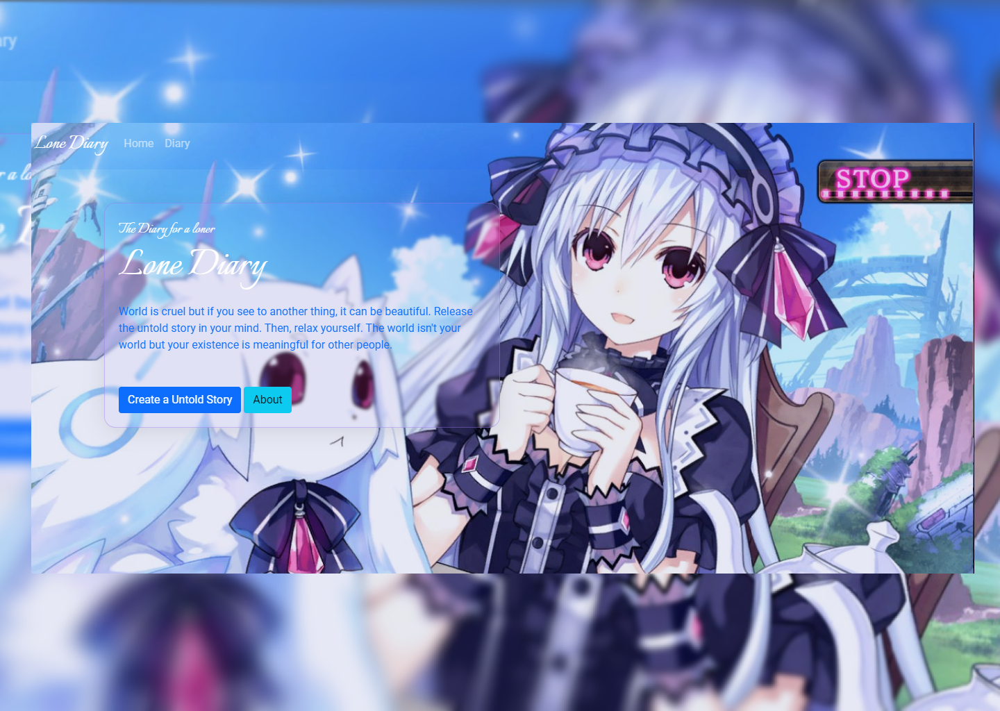

# Lone Diary

## What is it?

Just a random diary but i confused how to deploy it with free server, hehehe

## How to use it?

1. Click code button in this repo and you can choose how to download it. With Download Zip or clone.
2. Import the lonediary.sql to your MySQL
3. Try it?

## Why I Created it?

Well, probably in the near future, i have some activity to do with laravel. So, i think created it to forging my experience and access my forgotten memory.

## Is it perfect?

Honestly, it is imperfect. I have some activity that need more priority than created it. So, i couldn't perfecting it.
